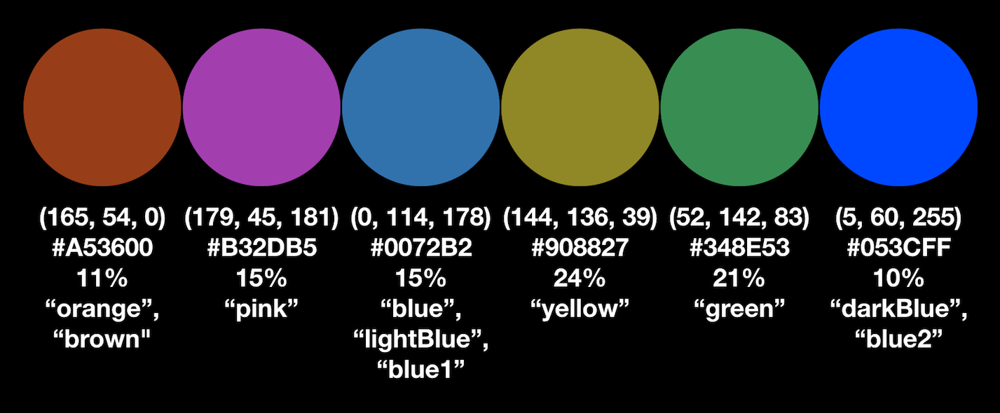
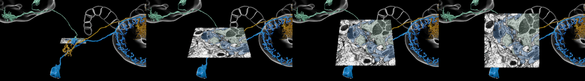
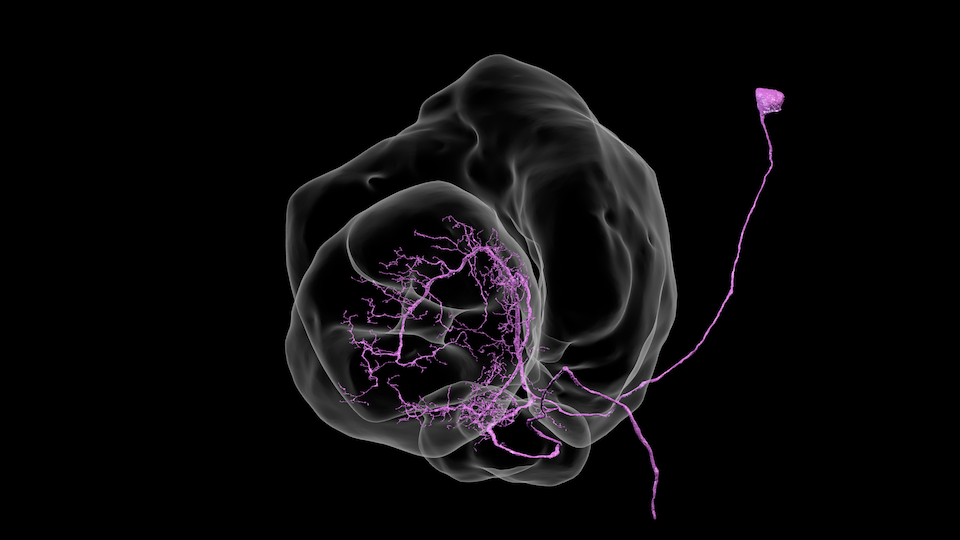
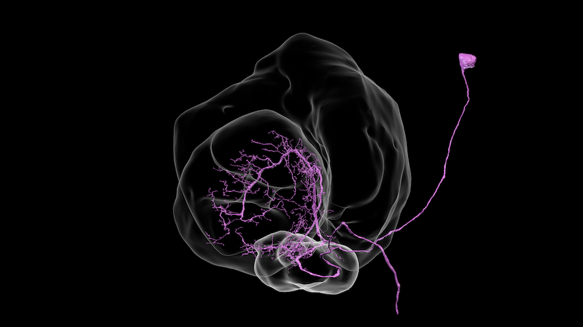

# neuVid Documentation

## Introduction

The goal of `neuVid` is to simplify production of the rather stereotyped videos common in neuroscience research on the *Drosophila* fruit fly.  An important aspect of these videos is that they have simple camera motion: the camera usually starts looking at the fly brain face on (i.e., as if the fly were looking straight at the camera with its right on the camera's left), and translates freely but changes its viewing direction only by rotating around the  vertical axis.  The absence of free-form camera motion helps viewers stay oriented and understand what they are seeing.  It also keeps `neuVid` simple, with simpler commands to specify the animation, and a simpler implementation of those commands in Blender.

## The Simplest Video

Probably the simplest video shows a single neuron spinning around the vertical axis.  With `neuVid`, such a video can be defined with twelve lines of text, nicely formatted.

The input to `neuVid` is [JSON](https://en.wikipedia.org/wiki/JSON), a simple structured filed format.  Its most important elements are:
- *arrays*, which are lists of values, delineated by `[` and `]`;
- *objects*, which are dictionaries or maps from keys to values, delineated by `{` and `}`.

Here is a `neuVid` input file for the simplest video:

```json
{
  "neurons" : {
    "anchor" : [
      508689623
    ],
    "source" : "https://hemibrain-dvid.janelia.org/api/node/52a13/segmentation_meshes"
  },
  "animation" : [
    [ "frameCamera", { "bound" : "neurons.anchor" } ],
    [ "orbitCamera", { "duration" : 12.0 } ]
  ]
}
```

The video then would be generated using these steps, described in more detail in the [Basic Usage](../README.md#basic-usage) documentation:

```
blender --background --python neuVid/importMeshes.py -- -ij /tmp/simplest.json -o /tmp/simplest.blend
blender --background --python neuVid/addAnimation.py -- -ij /tmp/simplest.json -ib /tmp/simplest.blend -o /tmp/simplestAnim.blend
blender --background --python neuVid/render.py -- -ib /tmp/simplestAnim.blend -o /tmp/framesFinal
blender --background --python neuVid/assembleFrames.py -- -i /tmp/framesFinal -o /tmp
```

The `-o` and `-ib` arguments may be omitted with their values being inferred from `-ij /tmp/simplest.json`, allowing this more concise version:

```
blender --background --python neuVid/importMeshes.py -- -ij /tmp/simplest.json
blender --background --python neuVid/addAnimation.py -- -ij /tmp/simplest.json
blender --background --python neuVid/render.py -- -ij /tmp/simplest.json -o /tmp/framesFinal
blender --background --python neuVid/assembleFrames.py -- -i /tmp/framesFinal -o /tmp
```

It is easiest to edit a JSON file in a modern text editor that understands and visually highlights the JSON file format; a good candidate that works on most platforms is [`atom`](https://atom.io/).  By default, JSON does not allow comments.  In `neuVid`, comment lines starting with `#` or `//` are allowed, as they are stripped before further JSON processing.  The visually highlighting in `atom` does get confused by such comments, though.

Be careful not to add a comma after the last item in a JSON array (e.g., use `[1, 2, 3]`, not `[1, 2, 3,]`).  This common mistake produces a somewhat cryptic error message (e.g., `json.decoder.JSONDecodeError: Expecting value: line 17 column 3 (char 495)` if there is an extra comma on line 16).

## The Simplest Video, Deconstructed

The top-level JSON object in the input file has two major sections.

The `neurons` key starts the *definitions section*.  This section associates *names* with data that will be imported as polygonal meshes that Blender can render.  The `neurons` key's value is an object, and its `anchor` key is an example of a name.  The `anchor` name is associated with that key's value, an array containing the identifier number `508689623`.  Any use of the name `neurons.anchor` thus refers to the neuron with that identifier.

Implicitly, all the named neurons are rendered as meshes.  Where these meshes come from is described by the `neuron` object's `source` key.  In this case, its value states that the meshes come from a [DVID server](https://hemibrain-dvid.janelia.org), specifically, its `segmentation_meshes` data instance.

The first explicit use of the `neurons.anchor` name occurs in the other major section, the *animation section*.  In the top-level object, the `animation` key's value is an array of *commands* that describe the animation that Blender will render.  The first command, `frameCamera`, tells Blender how to position the camera: the bounding box for `neurons.anchor` should mostly fill the camera frame, with the camera looking at the fly's brain face on.  Note that this useful camera composition is specified symbolically, without the use of absolute coordinates.  Minimizing the need for absolute coordinates is one of the guiding principles of `neuVid`.

The other command in the animation section, `orbitCamera`, describes the first actual animation, or change over time.  This command makes the camera take 12 seconds to rotate 360° around the center of `neurons.anchor`'s bounding box, with the axis of rotation being the vertical axis.  While the length of the animation is specified explicitly with the `duration` argument, the other details are defined implicitly: the center of rotation comes from `neurons.anchor`'s  bounding box because that was the target for the previous camera command, `frameCamera`, and the final rotation angle of 360° makes sense because full rotation back to the starting point is a common choice.
This implicit behavior can be changed with optional arguments to `orbitCamera`, but having usable defaults is another guiding principle of `neuVid`.

When the input file is edited, some `neuVid` scripts need to be rerun, but which scripts depends on which sections were changed.  Edits to the definitions section require rerunning the `importMeshes.py` script and then the `addAnimation.py` script.  (If synapses are changed, then the `buildSynapses.py` script must be run before `importMeshes.py`; see the [Synapses](#synapses) documentation.)  Edits to the animation section require rerunning only the `addAnimation.py` script.

## Previewing

For videos more complex than the simplest one, it is useful to see a preview before taking the time to render all the frames.  The simplest way to do so is to run the interactive Blender application and load the file produced by `addAnimation.py`. Press the "Play Animation" button by the timeline to see a low-quality rendering of the animation at near-realtime rates.

While that approach is a good way to verify many parts of an animation, the rendering does not represent transparency or silhouette shading well.  To preview the real rendering, another approach is to render only every `n` frames (e.g., `n` of 24 would render on frame per second of final animation, for the default 24 frames per second).  The `render.py` script supports this approach with the `-j n` (or `--frame-jump n`) argument.

To render only a single frame, `f`, use `render.py`'s `-s f -e f` (or `--frame-start f --frame-end f`) arguments.

## Categories

The `neurons` key in the simplest video is one example of a *category*.  Names associated with data, like `anchor`, are defined within a category, and the category determines how that data will be rendered by Blender.  

There are four categories in `neuVid`, each with its own key in the definitions section:

- `neurons`: Neurons are rendered as colored surfaces with shading and shadows (which look better with the Octane renderer).
- `rois`: ROIs are rendered as white silhouettes.
- `synapses`: Synapses are rendered as colored balls, with a bit of extra brightness suggesting that they emit light.
- `grayscales`: This rather specialized category is for 2D images, with the typical usage being to show the grayscale images of the original electron microscopy (EM) data.  These images are rendered as a special "picture in picture" element on in front of the 3D rendering.

Each category is optional.  If a video shows only neurons, for example, it would not need the keys for `rois`, `synapses`, and `grayscales`.

Here is an example that adds the `rois` category to the previous example with `neurons`:

```json
{
  "neurons" : {
    "anchor" : [
      508689623
    ],
    "source" : "https://hemibrain-dvid.janelia.org/api/node/52a13/segmentation_meshes"
  },
  "rois" : {
    "source" : "https://hemibrain-dvid.janelia.org/api/node/52a13/roisSmoothedDecimated",
    "step1" : [
      "MB(R)", "LAL(R)"
    ]
  },
  "animation" : [
    [ "setValue", { "meshes" : "rois.step1", "alpha" : 0.05 } ],
    [ "frameCamera", { "bound" : "neurons.anchor" } ],
    [ "orbitCamera", { "duration" : 12.0 } ]
  ]
}
```

The `rois` category in this example defines a name, `rois.step1` that is associated with *two* ROIs.  The `source` key specifies that the meshes for these ROIs are loaded from [another data instance of the DVID server](https://hemibrain-dvid.janelia.org), `roisSmoothedDecimated`.  The actual ROI names should follow the standards of DVID as presented by the [`neuPrintExplorer`](https://neuprint.janelia.org/?dataset=hemibrain%3Av1.0.1) user interface (e.g., `aL(R)`, `b'L(R)`, `EB`, etc.).  Note that the order of keys in an object is irrelevant, and the `rois` category has the `source` key first.

Note also that the same name can be reused in different categories (e.g., `rois.step1` could have been `rois.anchor` without conflicting with `neurons.anchor`), and the names in the categories need not match.

The animation section in this example has a new command, `setValue`.  This command changes the alpha (transparency) value for the meshes associated with the `rois.step1` name.  This one command affects all that name's meshes, so it affects both `MB(R)` and `LAL(R)`.  The [Transparency and Color](#transparency-and-color) documentation, below, discusses alpha in more detail.  Using names as command arguments provides *indirection*, so an animation for a neuron can be defined without explicit mention of that neuron's identifier, and can be reused with a different neuron simply by changing the name definition.

Both `source` values are DVID URLs in this example.  Using such a URL, `neuVid` fetches the appropriate meshes and saves them as [OBJ files](https://en.wikipedia.org/wiki/Wavefront_.obj_file) in local directories to be used by Blender.  For `neurons` the directory is `neuVidNeuronMeshes`, and for `rois` it is `neuVidRoiMeshes`, with both directories created in the same directory as the input JSON file.  As an alternative, the `source` value can specify the directory Blender should use for the OBJ files.  For `neurons`, OBJ files in this directory should have names like `508689623.obj`.  For `rois`, it does not work to use the standard ROI names, as most platforms do not allow parentheses so file names like `MB(R).obj` are not valid.  A solution is to use names like `MBR.obj` and `LALR.obj`, making sure that the `rois` category matches:

```json
{
  "neurons" : {
    "anchor" : [
      508689623
    ],
    "source" : "https://hemibrain-dvid.janelia.org/api/node/52a13/segmentation_meshes"
  },
  "rois" : {
    "source" : "/tmp/localMeshDirectory/",
    "step1" : [
      "MBR", "LALR"
    ]
  },
  "animation" : [
    [ "setValue", { "meshes" : "rois.step1", "alpha" : 0.05 } ],
    [ "frameCamera", { "bound" : "neurons.anchor" } ],
    [ "orbitCamera", { "duration" : 12.0 } ]
  ]
}
```

## Time

The simplest video uses the `orbitCamera` command with a `duration` argument to make animated camera motion start at the beginning of the video and end 12 seconds later.  To specify changes that start at any time after the beginning of the video, use the `advanceTime` command.  Here is an example:

```json
{
  "rois" : {
    "source" : "https://hemibrain-dvid.janelia.org/api/node/52a13/roisSmoothedDecimated",
    "step1" : [
      "MB(R)"
    ],
    "step2" : [
      "LAL(R)"
    ]
  },
  "neurons" : {
    "anchor" : [
      508689623
    ],
    "source" : "https://hemibrain-dvid.janelia.org/api/node/52a13/segmentation_meshes"
  },
  "animation" : [
    [ "frameCamera", { "bound" : "rois.step1" } ],

    [ "advanceTime", { "by" : 1.0 } ],

    [ "frameCamera", { "bound" : "rois.step2", "duration" : 2.0 } ],
    [ "advanceTime", { "by" : 2.0 } ],

    [ "advanceTime", { "by" : 1.0 } ],

    [ "frameCamera", { "bound" : "rois.step1 + rois.step2", "duration" : 2.0 } ],
    [ "advanceTime", { "by" : 2.0 } ],

    [ "advanceTime", { "by" : 1.0 } ]
  ]
}
```

The animation opens with the camera framed on the bounds for `rois.step1`. The next command is `advanceTime` `by` `1.0` seconds (omitting the extra JSON syntax).  The result is that the subsequent `frameCamera` command with `duration` `2.0` causes the camera to start moving one second into the video and end three seconds in.

Note that even though that `frameCamera` command specifies `duration` `2.0`, the time at which any subsequent command would start remains at one second into the video.  Thus, additional `advanceTime` commands are necessary to make the subsequent commands start later.

Note also the use of *two* `advanceTime` commands, one with `duration` `2.0` and then another with `duration` `1.0`.  The same effect would be possible with one `advanceTime` command of `duration` `3.0`, but using two commands reinforces the idea that there is time advancement to match the `duration` of the `frameCamera` command for `rois.step2`, and then additional time advancement to add a pause before the start of the next command.  This approach makes it a bit simpler to edit the input to change the length of the pause.

The next command is a third `frameCamera`.  It specifies that the framing should be on the bounds of `rois.step1 + rois.step2`.  The effect is to make the camera frame on the union of the two bounds.  No set operators other than `+` are supported for the `bound` argument, but the next section discusses a more powerful case for other arguments of other commands.

## Transparency and Color

The transparency of a mesh is controlled by the *alpha* value on the mesh's material.  The [Catetories](#categories) documentation showed how the `setValue` command can specify an alpha for a mesh for the duration of a video.

To vary the alpha, use the `fade` command.  It takes a `duration` argument so the alpha can change gradually over time, which looks more appealing than an abrupt change.  Here is an example:

```json
{
  "neurons" : {
    "source" : "https://hemibrain-dvid.janelia.org/api/node/52a13/segmentation_meshes",
    "anchor" : [
      508689623
    ],
    "connectedToAnchor" : [
      976506780, 763730414
    ]
  },
  "animation" : [
    [ "frameCamera", { "bound" : "neurons.anchor + neurons.outputsToAnchor" } ],
    [ "orbitCamera", { "duration" : 12.0 } ],

    [ "advanceTime", { "by" : 4.0 } ],

    [ "fade", { "meshes" : "neurons.connectedToAnchor", "startingAlpha" : 0.0, "endingAlpha" : 1.0, "duration" : 2.0 } ],
    [ "advanceTime", { "by" : 2.0 } ],

    [ "advanceTime", { "by" : 4.0 } ],

    [ "fade", { "meshes" : "neurons.connectedToAnchor", "startingAlpha" : 1.0, "endingAlpha" : 0.0, "duration" : 2.0 } ],
    [ "advanceTime", { "by" : 2.0 } ]
  ]
}
```

An alpha of zero makes a mesh completely transparent, while an alpha of one makes it completely opaque.  If no alpha is specified with a `setValue` or `fade` command, it is one by default, so `neurons.anchor` keeps an alpha of one for the whole video.

Note that the two `fade` commands have starting and ending times completely within the duration of the `orbitCamera` command.  It is fine to overlap animation commands in this way, to create more sophisticated effects.

Color is closely related to transparency.  By default, `neuVid` assigns colors to neuron meshes automatically, drawing from a six-color palette:



This palette is based on a common [color-blind-friendly palette](https://www.color-hex.com/color-palette/49436).  The colors have been changed slightly to make their [relative luminance](https://en.wikipedia.org/wiki/Relative_luminance) values (the percentages in the third row) more similar.  Relative luminance describes the brightness of the color as perceived by a human, and making these values more similar reduces the chance that some colors will appear more prominent.  The change to relative luminance made the palette somewhat less effective in color-blind conditions, but nevertheless it works relatively well for 3D renderings, where lighting also affects the colors.

It is possible to override the automatic assignment of colors to neuron meshes.  The `setValue` command with the argument `color` is a good way to make a change for the whole video, while `fade` can be used to interpolate between the `startingColor` and `endingColor` arguments over a `duration`.  The value of a `color`, `startingColor` or `endingColor` argument can take any of several forms, as illustrated in the following example:

```json
{
  "neurons" : {
    "source" : "https://hemibrain-dvid.janelia.org/api/node/52a13/segmentation_meshes",
    "main" : [
      508689623
    ],
    "partners" : [
      5813022375, 763730414
    ],
    "more" : [
      914778159, 976506780
    ],
    "special" : [
      763730414
    ]
  },
  "animation" : [
    [ "setValue", { "meshes" : "neurons.main", "color" : 3 } ],
    [ "setValue", { "meshes" : "neurons.special", "color" : "green" } ],
    [ "setValue", { "meshes" : "neurons.partners + neurons.more - neurons.special", "color" : "#ababab" } ],

    [ "frameCamera", { "bound" : "neurons.main" } ],
    [ "orbitCamera", { "duration" : 12.0 } ]
  ]
}
```

Each of the three `setValue` commands shows one of the ways of specifying colors:

- an index value between 0 and 5, to choose from the colors in the order of the image, above;
- a name of a color, from the choices in the bottom rows of the image, above;
- a custom color using the [CSS hex notation](https://www.w3schools.com/colors/colors_hexadecimal.asp), a string starting with `#` followed by two hexidecimal digits each for the red, green, and blue components.

Note that int the last `setValue` command, the `meshes` argument has the value `neurons.partners + neurons.more - neurons.special`.  The effect is to assign the `#ababab` color to all the neurons in `neurons.partners` and `neurons.more` except the neurons in `neurons.special`.  Any `meshes` argument can use set operations like these on names from the `neurons` and `rois` categories, but not from the `synapses` category.

The `rois` category renders meshes as silhouettes, with mesh faces becoming more transparent as they come closer to facing the camera.  To control how quickly this transition to transparency occurs, the `rois` category has an optional key, `exponents`.  The default value is five, and a *higher* value makes a mesh transition to transparency *faster*.  Here is an example assigning a value of eight to a group of ROIs that should be deemphasized:

```json
{
  "rois" : {
    "source" : "https://hemibrain-dvid.janelia.org/api/node/52a13/roisSmoothedDecimated",
    "deemphasized" : [
      "FB", "EB"
    ],
    "emphasized" : [
      "NO"
    ],
    "exponents" : {
      "deemphasized" : 8
    }
  }
}
```

In the `exponents` object, the special key `*` refers to all ROIs not explicitly mentioned in other keys.  See the [Tips](#tips) documentation, below, for some ideas about how to use `exponents` and `alpha`.

## Synapses

Synapses appear as little spheres, and are defined by names in the `synapses` category.  Here is a simple example:

```json
{
  "neurons" : {
    "source" : "https://hemibrain-dvid.janelia.org/api/node/52a13/segmentation_meshes",
    "anchor" : [
      508689623
    ]
  },
  "synapses" : {
    "source" : "https://neuprint.janelia.org/?dataset=hemibrain:v1.0.1",
    "anchorPSD" : {
      "neuron" : 508689623,
      "type" : "post"
    }
  },
  "animation" : [
    [ "setValue", { "meshes" : "synapses.anchorPSD", "color" : "#303030" } ],
    [ "frameCamera", { "bound" : "neurons.anchor" } ],

    [ "fade", { "meshes" : "neurons.anchor", "startingAlpha" : 1.0, "endingAlpha" : 0.8, "duration" : 2.0 } ],
    [ "fade", { "meshes" : "synapses.anchorPSD", "startingAlpha" : 0.0, "endingAlpha" : 1.0, "duration" : 2.0 } ],
    [ "advanceTime", { "by" : 2.0 } ],

    [ "pulse", { "meshes" : "synapses.anchorPSD", "toColor" : "#ffffff", "duration" : 4.0 } ],
    [ "advanceTime", { "by" : 4.0 } ]
  ]
}
```

In the `synapses` category, the `source` key must be a [`neuPrintExplorer`](https://neuprint.janelia.org/?dataset=hemibrain%3Av1.0.1) URL.  Each other key defines the name for a synapse set.  In this example, the `synapses.anchorPSD` name refers to to synapses from the neuron `508689623`, and the `type` key being `post` limits these synapses to the post-synaptic sites (PSDs).

PSDs have a gray color in the [`NeuTu` proofreading system](https://github.com/janelia-flyem/NeuTu), so the `setValue` command changes the meshes for `synapses.anchorPSD` to have a similar color.

Synapse locations can be slightly inside the branches of neurons, which makes the display of synapses and neurons as solid objects challenging.  It helps somewhat to make the neurons slightly transparent, so the first `fade` command does exactly that, making `neurons.anchor` become 80% opaque over a period of two seconds.  Simultaneously, the other `fade` command makes `synapses.anchorPSD` fully opaque.

Even with this fading, smaller synapse sets may be hard to notice, especially if they are colored gray.  The `pulse` command can help by gently (once per second) cycling from the current color to a highlighting color, which is white in this example.

As described in more detail in the [Usage with Synapses](../README.md#usage-with-synapses) documentation, animations with synapses require the running of an extra script, `buildSynapses.py`.  This script queries the synapse locations from the `neuPrint` server mentioned in the `source` URL.  The full set of steps to generate the animation are as follows:

```
python neuVid/buildSynapses.py -ij /tmp/synapses.json
blender --background --python neuVid/importMeshes.py -- -ij /tmp/synapses.json
blender --background --python neuVid/addAnimation.py -- -ij /tmp/synapses.json
blender --background --python neuVid/render.py -- -ij /tmp/synapses.json -o /tmp/framesFinal
blender --background --python neuVid/assembleFrames.py -- -i /tmp/framesFinal -o /tmp
```

The object for `anchorPSD` has two keys, but `neuVid` supports additional keys to fine tune a synapse set:

- The `type` value can be `pre` for pre-synaptic sites (T-bars) or `post` for post-synaptic sites (PSDs), or omitted for both.  For `pre`, use `setValue` `color` `yellow` to match the coloring of NeuTu.
- If `radius` specifies a number then the rendered sphere for each synapse has that radius.
- If `partner` specifies the identifier for another neuron, then synapses are limited to those shared with that neuron.
- If `roi` specifies the name of an ROI, then synapses are limited to those in that ROI.  Boolean operators are supported (e.g., `"roi" : "not EB and not FB"` for only the synapses outside of both `EB` and `FB`) but not grouping parentheses.
- The `includeWithin` key can specify a bounding-box object to put spatial limits on the synapses.  This object can have any combination of `xMin`, `xMax`, `yMin`, `yMax`, `zMin` or `zMax` as keys (e.g., `"includeOnly" : { zMax : 19000 }` omits any synapse with `z` coordinates larger than 19,000).

## Grayscale Images

*Incomplete*

- The `grayscales` category, names map to:
  - `source`: one image, or an .avi file for a "movie texture"
  - `position`
- Use `centerCamera` to get the position.
- Use `showPictureInPicture` to animate a rotating "card" that shows the image or movie texture
- Card animation makes sense for EM slices, which are small and perpendicular to the standard viewing angle



## Advanced

*Incomplete*

- Input JSON arguments for `render.py`:
  - `fps`
  - `lightPowerScale`
  - `lightSizeScale`
  - `lightDistanceScale`
  - `lightColor`
  - `useShadows`
  - `useSpecular`
- Rendering with Octane:
  - `--octane` argument
  - `--roi` argument
  - `compRoisAndNeurons.py` script
- Too much mesh data to load at once:
  - `neurons` category `sources` can be an array, for multiple levels of detail
  - `neurons` category `idSources` is a directory for files that list neuron identifiers
  - `neurons` category name keys have an object value, with `sourcesIndex` choosing from the `sources` array and `ids` listing files from `idSources`
  - Works if only one (or so) `neurons` names are visible at any time, and `render.py` has logic to detect this
  - Made the "Fly Hemibrain Overview" video possible, rendered with Octane

[](https://www.youtube.com/watch?v=PeyHKdmBpqY)

## Tips

### Using `exponents` and `alpha` for ROIs

The visual appearance of ROIs is a matter of personal taste, but here are some ideas that have worked well in practice.

Under normal circumstances, the `rois` category's `exponents` key is not needed, and an `alpha` of `0.05` looks reasonable for all ROIs:



To emphasize one ROI, give it an `alpha` of `0.2` and deemphasize all the other ROIs by giving them `exponents` values of `8`:



To give all ROIs a lighter look, use the `*` key in `exponents` to give everything a value of `7` or `8`.

### Getting `position` values

The `neuVid` input avoids literal positions as much as possible (e.g., `frameCamera` sets the camera position implicitly so some objects fill the view).  Nevertheless, literal positions sometimes are unavoidable (e.g., when the camera view should be filled with just part of an object, with `centerCamera`).  One way to get the coordinates of a literal position is to use [`neuPrintExplorer`](https://neuprint.janelia.org/?dataset=hemibrain%3Av1.0.1): in the skeleton view, shift-click on a particular position on a neuron body sets the camera target to that position.  All that is needed, then, is a way to get that target position from `neuPrintExplorer`.

For better or worse, `neuPrintExplorer`'s current user interface does not present that target position.  The best work-around for now is to get the target position from the URL `neuPrintExplorer` creates for the skeleton view.  Doing so requires a few particular steps, to force the URL to be updated accordingly:

1. Do a "Find Neurons" query for the neuron body in question.
2. Click on "eye" icon to split the query result panel, with the right half being a skeleton view showing the neuron.
3. Close the skeleton viewer in the right half.
4. Go to the "SKELETON" tab that still exists after the "NEUROGLANCER" tab.
5. Shift-click to set the camera target.
6. Go to the "NEUROGLANCER" tab, then immediately back to the "SKELETON" tab.
This switching of tabs makes the `neuPrintExplorer` URL contain a "coordinates" section near the end, with the camera position and target.
7. In a terminal shell run the script to parse that URL and extract the target.  Note: with most shells, the URL must be enclosed in single quotes(') to avoid problems due to the special characters in the URL.
```
python neuVid/parseTarget.py 'https://neuprint.janelia.org/results?dataset...%5D%5Bcoordinates%5D=31501.69753529602%2C63202.63782931245%2C23355.220703777315%2C22390.66247762118%2C24011.276508917697%2C31327.48613433571&tab=2&ftab='
```
9. The camera target position will be printed to the shell, in a form that can be used directly with, say, `centerCamera`.
```
[22391, 24011, 31327]
```
10. To get another target position, shift-click again, and then repeat steps 6 through 9 again.  It is necessary to go to the "NEUROGLANCER" tab and then back to the "SKELETON" tab to force the URL to update with the new camera target.

## Command Summary

*Incomplete*

General command syntax:
```
[ "commandName", { "argumentKey1" : argumentValue1, ..., "argumentKeyN" : argumentValueN }]
```

### `advanceTime`

Required arguments:
- `by`

### `centerCamera`

Required arguments:
- `position`

Optional arguments:
- `fraction` (default: 1)
- `duration` (default: 1)

### `fade`

Required arguments:
- `startingAlpha` or `startingColor`
- `endingAlpha` or `endingColor`
- `meshes`

Optional arguments:
- `duration` (default: 1)
- `stagger`

### `frameCamera`

Required arguments:
- `bound`

Optional arguments:
- `duration` (default: 1)

### `orbitCamera`

Optional arguments:
- `around` (default: the last camera target)
- `endingRelativeAngle` (default: -360)
- `duration` (default: 1)

### `pulse`

Required arguments:
- `meshes`

Optional arguments:
- `toColor` (default: #ffffff)
- `duration` (default: 1)

### `setValue`

Required arguments:
- `meshes`
- `alpha` or `color`

### `showPictureInPicture`

Required arguments:
- `source`

Optional arguments:
- `duration` (default: 3)
