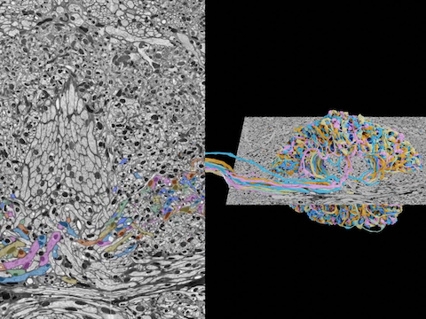
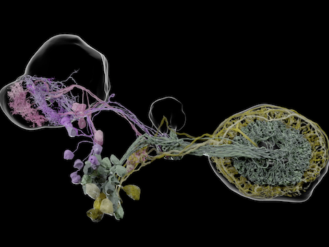
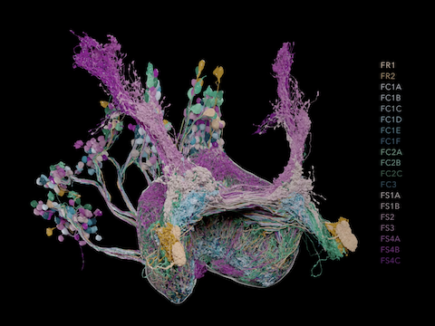
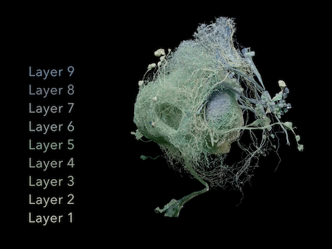
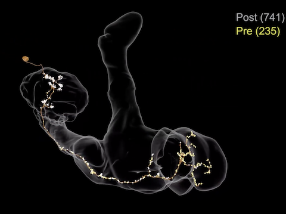

# neuVid Gallery

Click on an image to play the video. [Return to the neuVid documentation](https://github.com/connectome-neuprint/neuVid).

## FlyEM MANC 1.0 (2023)

[FlyEM MANC project page](https://www.janelia.org/project-team/flyem/manc-connectome)

 
<em>Drosophila</em> MANC (male adult nerve cord) overview.

## The Explorer's Guide to Biology (2023)

[The neuron: from Cajal to the connectome](https://explorebiology.org/summary/neuroscience/the-neuron-from-cajal-to-the-connectome)

 
Scientists reconstruct the 3D shapes of neurons from stacks of 2D serial sections acquired with electron microscopes.

## FlyLight (2023)

[FlyLight project page](https://www.janelia.org/project-team/flylight)

 
Representative expression patterns in the <em>Drosophila</em> visual system.

## OpenOrganelle (2022)

[OpenOrganelle data portal](https://openorganelle.janelia.org/)

 
<a href="https://openorganelle.janelia.org/news/2022-11-02-fenestra-in-hepatic-endothelial-cells">Fenestra in Hepatic endothelial cells.</a>

 
Macrophage cell.

 
HeLa cell.

## Hulse et al. (2021)

Brad K Hulse, et al., "A connectome of the *Drosophila* central complex reveals network motifs suitable for flexible navigation and context-dependent action selection", 
 https://doi.org/10.7554/eLife.66039

 
Supplemental video 2: Morphological rendering of two parallel pathways in the anterior visual pathway.

 
Supplemental video 10: Morphological renderings of the FR, FC, and FS neurons.

 
Supplemental videom 13: Morphological renderings of the fan-shaped body (FB) tangential neurons.

## Li et al. (2021)

Feng Li, et al., "The connectome of the adult *Drosophila* mushroom body provides insights into function",
https://doi.org/10.7554/eLife.62576

<!-- figure 9, video 1 -->

 
Figure 9, video 1: <em>Drosophila</em> Kenyon cells, γ type, with synapses.  Second runner up for the <a href="https://drosophila-images.org/2021-2">2021 Drosophila Image Award</a> from the <a href="https://genetics-gsa.org">Genetics Society of America</a>.

[Marisa Dreher](https://dreherdesignstudio.com) made dozens of additional videos for this paper using neuVid.

## FlyEM Hemibrain 1.0 (2020)

[Hemibrain project page](https://www.janelia.org/project-team/flyem/hemibrain)

 
Fly hemibrain overview. Winner of the <a href="https://drosophila-images.org/2021-2">2021 Drosophila Image Award</a> from the <a href="https://genetics-gsa.org">Genetics Society of America</a>.

 
Fly central complex circuitry.

 
<em>Drosophila</em> neuron types.

